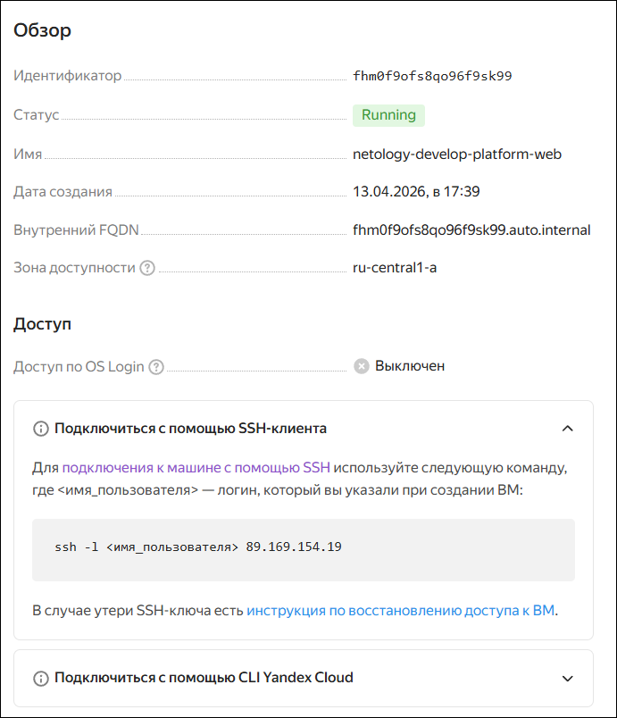
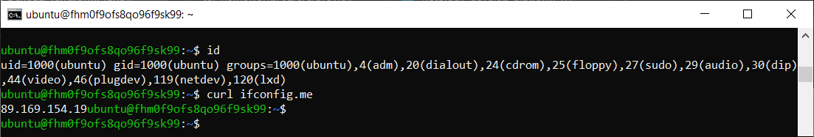
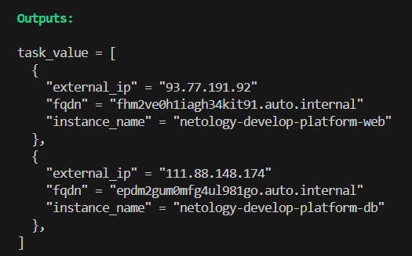
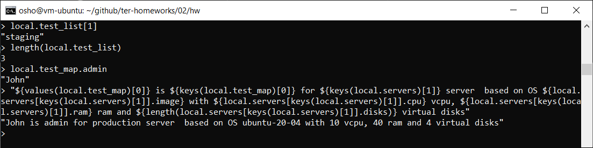
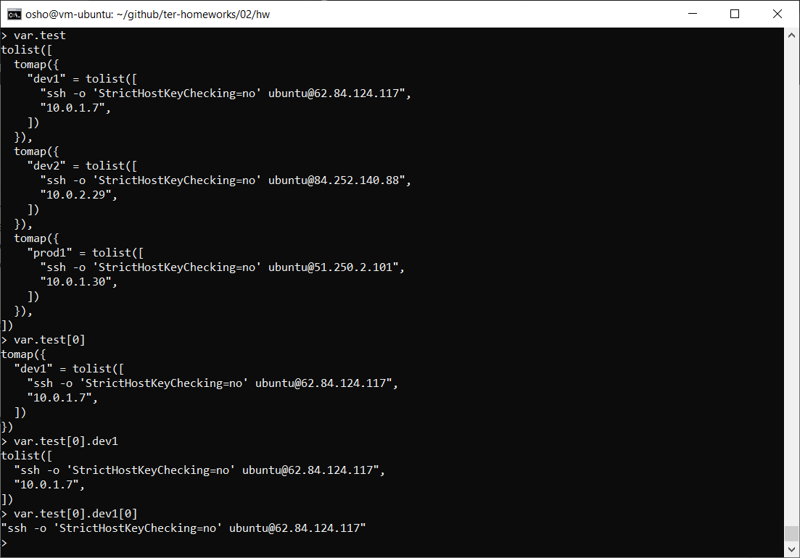
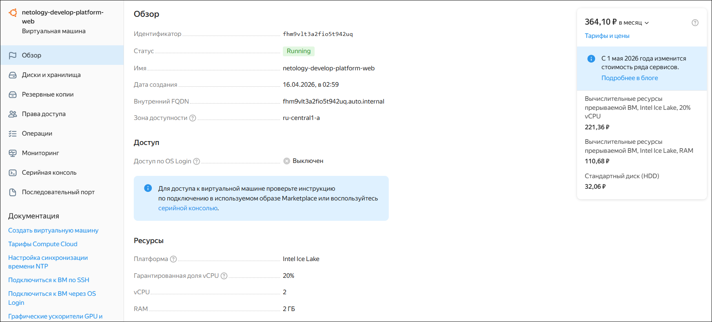
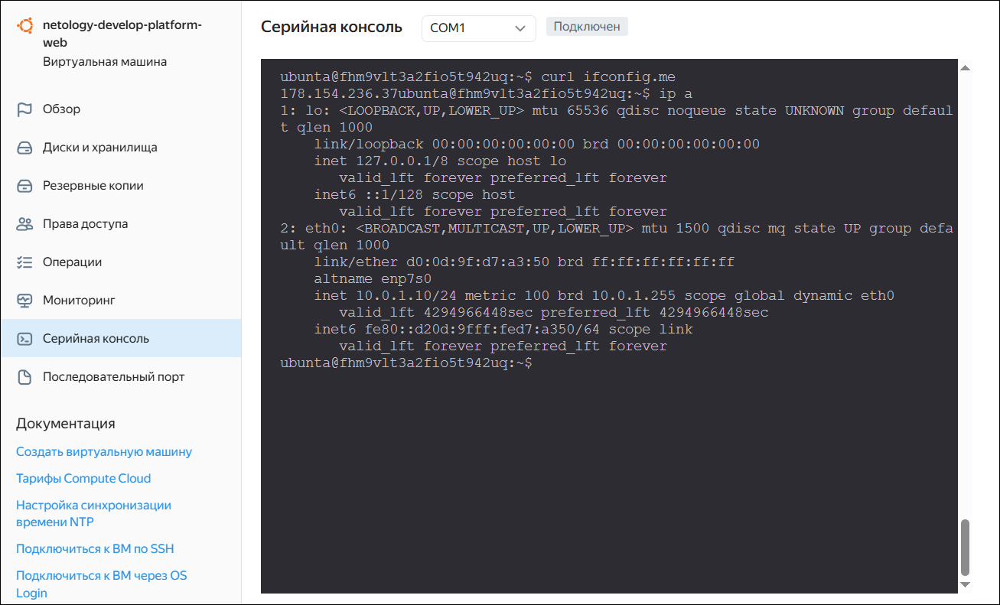
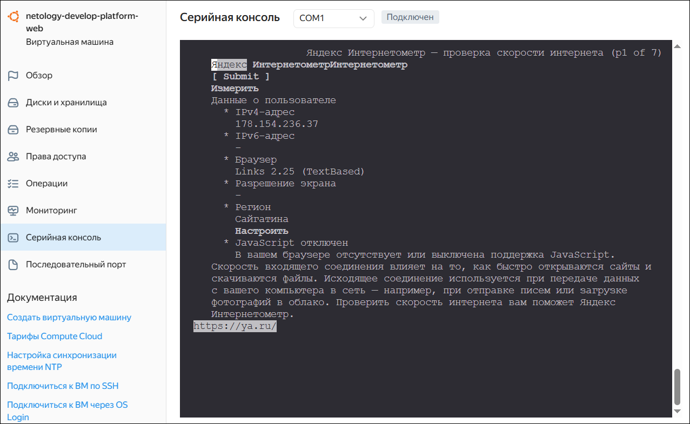
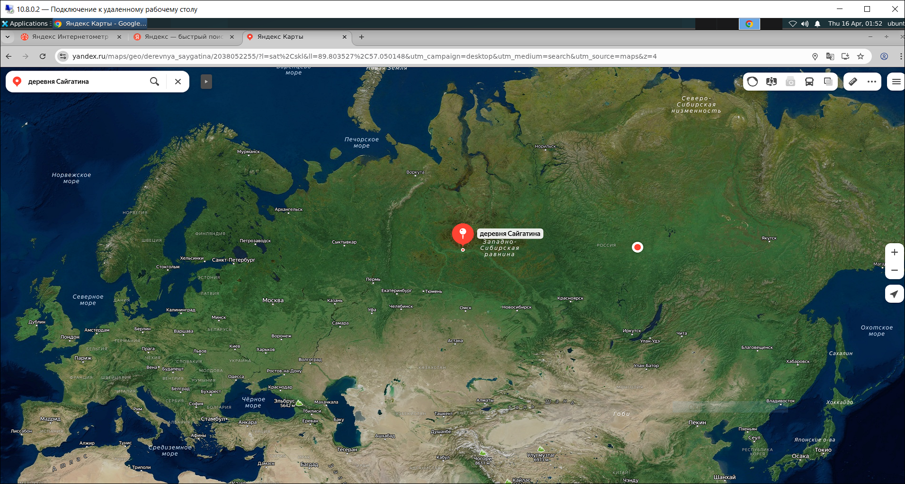
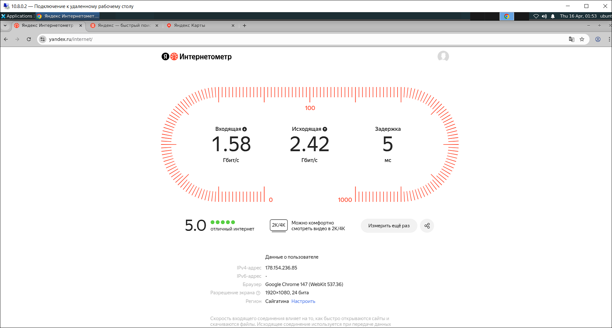

# Домашнее задание к занятию «Основы Terraform. Yandex Cloud»

### Цели задания

1. Создать свои ресурсы в облаке Yandex Cloud с помощью Terraform.
2. Освоить работу с переменными Terraform.


### Чек-лист готовности к домашнему заданию

1. Зарегистрирован аккаунт в Yandex Cloud. Использован промокод на грант.
2. Установлен инструмент Yandex CLI.
3. Исходный код для выполнения задания расположен в директории [**02/src**](https://github.com/netology-code/ter-homeworks/tree/main/02/src).


### Задание 0

1. Ознакомьтесь с [документацией к security-groups в Yandex Cloud](https://cloud.yandex.ru/docs/vpc/concepts/security-groups?from=int-console-help-center-or-nav). 
Этот функционал понадобится к следующей лекции.

------
> [!IMPORTANT]
> Внимание! Обязательно предоставляем на проверку получившийся код в виде ссылки на ваш github-репозиторий!
------

### Задание 1
В качестве ответа всегда полностью прикладывайте ваш terraform-код в git.
Убедитесь что ваша версия **Terraform** ~>1.12.0

1. Изучите проект. В файле *variables.tf* объявлены переменные для Yandex provider.
2. Создайте сервисный аккаунт и ключ. [service_account_key_file](https://terraform-provider.yandexcloud.net).
4. Сгенерируйте новый или используйте свой текущий ssh-ключ. Запишите его открытую(public) часть в переменную **vms_ssh_public_root_key**.
5. Инициализируйте проект, выполните код. Исправьте намеренно допущенные синтаксические ошибки. Ищите внимательно, посимвольно. Ответьте, в чём заключается их суть.
6. Подключитесь к консоли ВМ через ssh и выполните команду ``` curl ifconfig.me```.
Примечание: К OS ubuntu "out of a box, те из коробки" необходимо подключаться под пользователем ubuntu: ```"ssh ubuntu@vm_ip_address"```. Предварительно убедитесь, что ваш ключ добавлен в ssh-агент: ```eval $(ssh-agent) && ssh-add``` Вы познакомитесь с тем как при создании ВМ создать своего пользователя в блоке metadata в следующей лекции.;
8. Ответьте, как в процессе обучения могут пригодиться параметры ```preemptible = true``` и ```core_fraction=5``` в параметрах ВМ.

В качестве решения приложите:

- скриншот ЛК Yandex Cloud с созданной ВМ, где видно внешний ip-адрес;
- скриншот консоли, curl должен отобразить тот же внешний ip-адрес;
- ответы на вопросы.

### Решение 1

.\
├── [main.tf](files/task1/main.tf)\
├── [providers.tf](files/task1/providers.tf)\
└── [variables.tf](files/task1/variables.tf)

`preemptible = true` — прерываемая машина (будет остановлена через 24 часа, но деньги за ее существование всё-равно будут взиматься)

`core_fraction = 5` — количество гарантируемой мощности физического ядра процессора в процентах (%)





### Задание 2

1. Замените все хардкод-**значения** для ресурсов `yandex_compute_image` и `yandex_compute_instance` на **отдельные** переменные. К названиям переменных ВМ добавьте в начало префикс `vm_web_` .  Пример: `vm_web_name`.
2. Объявите нужные переменные в файле *variables.tf*, обязательно указывайте тип переменной. Заполните их `default` прежними значениями из *main.tf*. 
3. Проверьте `terraform plan`. Изменений быть не должно. 

### Решение 2

.\
├── *[main.tf](files/task2/main.tf)\
├── [providers.tf](files/task1/providers.tf)\
└── *[variables.tf](files/task2/variables.tf)


### Задание 3

1. Создайте в корне проекта файл *vms_platform.tf* . Перенесите в него все переменные первой ВМ.
2. Скопируйте блок ресурса и создайте с его помощью вторую ВМ в файле *main.tf*: `"netology-develop-platform-db"` ,  ```cores  = 2, memory = 2, core_fraction = 20```. Объявите её переменные с префиксом `vm_db_` в том же файле (*vms_platform.tf*).  ВМ должна работать в зоне `ru-central1-b`
3. Примените изменения.

### Решение 3

.\
├── *[main.tf](files/task3/main.tf)\
├── *[providers.tf](files/task3/providers.tf)\
├── *[variables.tf](files/task3/variables.tf)\
└── *[vms_platform.tf](files/task3/vms_platform.tf)

### Задание 4

1. Объявите в файле *outputs.tf* **один** `output` , содержащий: `instance_name`, `external_ip`, `fqdn` для каждой из ВМ в удобном лично для вас формате.(без хардкода!!!)
2. Примените изменения.

В качестве решения приложите вывод значений ip-адресов команды ```terraform output```.

### Решение 4

.\
├── [main.tf](files/task3/main.tf)\
├── *[outputs.tf](files/task4/outputs.tf)\
├── [providers.tf](files/task3/providers.tf)\
├── [variables.tf](files/task3/variables.tf)\
└── [vms_platform.tf](files/task3/vms_platform.tf)



### Задание 5

1. В файле *locals.tf* опишите в **одном** local-блоке имя каждой ВМ, используйте интерполяцию `${..}` с НЕСКОЛЬКИМИ переменными по примеру из лекции.
2. Замените переменные внутри ресурса ВМ на созданные вами local-переменные.
3. Примените изменения.

### Решение 5

.\
├── *[locals.tf](files/task5/locals.tf)\
├── *[main.tf](files/task5/main.tf)\
├── [outputs.tf](files/task4/outputs.tf)\
├── [providers.tf](files/task3/providers.tf)\
├── [variables.tf](files/task3/variables.tf)\
└── *[vms_platform.tf](files/task5/vms_platform.tf)

### Задание 6

1. Вместо использования трёх переменных  `.._cores`,`.._memory`,`.._core_fraction` в блоке  `resources {...}`, объедините их в единую map-переменную `vms_resources` и  внутри неё конфиги обеих ВМ в виде вложенного **map(object)**.  
   ```
   пример из terraform.tfvars:
   vms_resources = {
     web={
       cores=2
       memory=2
       core_fraction=5
       hdd_size=10
       hdd_type="network-hdd"
       ...
     },
     db= {
       cores=2
       memory=4
       core_fraction=20
       hdd_size=10
       hdd_type="network-ssd"
       ...
     }
   }
   ```
3. Создайте и используйте отдельную **map(object)** переменную для блока `metadata`, она должна быть общая для всех ваших ВМ.
   ```
   пример из terraform.tfvars:
   metadata = {
     serial-port-enable = 1
     ssh-keys           = "ubuntu:ssh-ed25519 AAAAC..."
   }
   ```  
  
5. Найдите и закоментируйте все, более не используемые переменные проекта.
6. Проверьте `terraform plan`. Изменений быть не должно.

### Решение 6

.\
├── *[locals.tf](files/task6/locals.tf)\
├── *[main.tf](files/task6/main.tf)\
├── [outputs.tf](files/task4/outputs.tf)\
├── [providers.tf](files/task3/providers.tf)\
├── *[variables.tf](files/task6/variables.tf)\
└── [vms_platform.tf](files/task5/vms_platform.tf)

------

## Дополнительное задание (со звёздочкой*)

**Настоятельно рекомендуем выполнять все задания со звёздочкой.**   
Они помогут глубже разобраться в материале. Задания со звёздочкой дополнительные, не обязательные к выполнению и никак не повлияют на получение вами зачёта по этому домашнему заданию. 


------
### Задание 7*

Изучите содержимое файла *console.tf*. Откройте `terraform console`, выполните следующие задания: 

1. Напишите, какой командой можно отобразить **второй** элемент списка `test_list`.
2. Найдите длину списка `test_list` с помощью функции `length(<имя переменной>)`.
3. Напишите, какой командой можно отобразить значение ключа `admin` из **map test_map**.
4. Напишите interpolation-выражение, результатом которого будет:\
*"John is admin for production server based on OS ubuntu-20-04 with X vcpu, Y ram and Z virtual disks"*\
Используйте данные из переменных `test_list`, `test_map`, `servers` и функцию `length()` для подстановки значений.

**Примечание**: если не догадаетесь как вычленить слово "admin", погуглите: "terraform get keys of map"

В качестве решения предоставьте необходимые команды и их вывод.

### Решение 7*

[console.tf](files/task7/console.tf)

1. 
    ```
    local.test_list[1]
    ```
    - в python работа с индексами

    ```
    test_list = ["develop", "staging", "production"]
    print(test_list[1])
    ```

2. 
    ```
    length(local.test_list)
    ```
    - в python

    ```
    test_list = ["develop", "staging", "production"]
    list_length = len(test_list)
    print(list_length)
    ```
3. 
    ```
    local.test_map.admin
    ```
    - `locals {test_map = {admin = "John"}}` — используется l.t.a
4. 
    ```
    "${values(local.test_map)[0]} is ${keys(local.test_map)[0]} for ${keys(local.servers)[1]} server  based on OS ${local.servers[keys(local.servers)[1]].image} with ${local.servers[keys(local.servers)[1]].cpu} vcpu, ${local.servers[keys(local.servers)[1]].ram} ram and ${length(local.servers[keys(local.servers)[1]].disks)} virtual disks"
    ```

    - "John is admin for production server  based on OS ubuntu-20-04 with 10 vcpu, 40 ram and 4 virtual disks"



------

### Задание 8*
1. Напишите и проверьте переменную `test` и полное описание ее **type** в соответствии со значением из *terraform.tfvars*:
```
test = [
  {
    "dev1" = [
      "ssh -o 'StrictHostKeyChecking=no' ubuntu@62.84.124.117",
      "10.0.1.7",
    ]
  },
  {
    "dev2" = [
      "ssh -o 'StrictHostKeyChecking=no' ubuntu@84.252.140.88",
      "10.0.2.29",
    ]
  },
  {
    "prod1" = [
      "ssh -o 'StrictHostKeyChecking=no' ubuntu@51.250.2.101",
      "10.0.1.30",
    ]
  },
]
```
2. Напишите выражение в `terraform console`, которое позволит вычленить строку *"ssh -o 'StrictHostKeyChecking=no' ubuntu@62.84.124.117"* из этой переменной.
------

### Решение 8*

[variables.tf](files/task8/variables.tf)

```
переменная = [ { ["x, x"] }, { ["x, x"] }, { ["x, x"] } ]
```
- Сначала список(list) — квадратные скобки — переменная = []
- В списке находится карта(map) — фигурные скобки — {}
- Внутри карты находится список(list) — квадратные скобки — []
- В этом списке находятся строки(string) — двойные кавычки — ""

Чтобы вывести строку *"ssh -o 'StrictHostKeyChecking=no' ubuntu@62.84.124.117"*

```
var.test[0].dev1[0]
```



------

### Задание 9*

Используя инструкцию https://cloud.yandex.ru/ru/docs/vpc/operations/create-nat-gateway#tf_1, настройте для ваших ВМ `nat_gateway`. Для проверки уберите внешний IP адрес (`nat=false`) у ваших ВМ и проверьте доступ в интернет с ВМ, подключившись к ней через **serial console**. Для подключения предварительно через ssh измените пароль пользователя: ```sudo passwd ubuntu```

### Решение 9*

Внесены корректировки в файл *main.tf*

```
# создание подсети в зоне A
resource "yandex_vpc_subnet" "web" {
  name           = "${var.vpc_name}-web"
  zone           = var.default_zone.web
  network_id     = yandex_vpc_network.cloud.id
  v4_cidr_blocks = [var.default_cidr.web]
  # ДОБАВЛЕНА ТАБЛИЦА МАРШРУТИЗАЦИИ ДЛЯ ПОДСЕТИ
  route_table_id = yandex_vpc_route_table.rt.id
}

# ДОБАВЛЕН NAT-ШЛЮЗ
resource "yandex_vpc_gateway" "nat_gateway" {
  folder_id      = "${var.folder_id}"
  name = "test-gateway"
  shared_egress_gateway {}
}

# ДОБАВЛЕНА ТАБЛИЦА МАРШРУТИЗАЦИИ
resource "yandex_vpc_route_table" "rt" {
  folder_id      = "${var.folder_id}"
  name       = "test-route-table"
  network_id = yandex_vpc_network.cloud.id

  static_route {
    destination_prefix = "0.0.0.0/0"
    gateway_id         = yandex_vpc_gateway.nat_gateway.id
  }
}
```



Внешнего IP адреса нет, **но**:


*для выхода в интернет он есть*




Заинтересовал меня этот регион **“Сайгатина”**

Установил на ВМ **WireGuard**. Настроил в качестве клиента.

Установил графический интерфейс и браузер **Google Chrome**.

Подключился к удаленному рабочему столу:



Точка справа — геолокация. Слева — то место, которое называется **“Сайгатина”** Разница в **1700** км. Удивительно.
Заметил, что IP адреса меняются периодически.

Решил измерить скорость интернета — я такую скорость “вживую” впервые вижу:



Удивительные это инструменты NAT-шлюз и таблица маршрутизации.